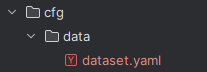
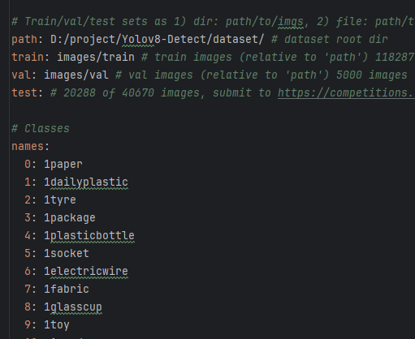

# YoloV8-Detect

## 数据处理
### data_process.py
用于处理数据，分成训练集和验证机
* xml_root = r"D:\project\data\yolov8\img_xml" 存储图片和xml label文件的路径
* save_path = "./dataset" 处理后数据存储的路径，之后需要在dataset的配置文件里修改
* classes.txt 存储类别信息，需要替换dataset.yaml中的Classes信息\
\
path：需要写绝对路径
train：相对路径
val: 相对路径\

### train.py
* 训练yolov8，需要配置模型加载路径，数据的配置文件路径

### inference.py
* 用于模型推理

```commandline
from ultralytics import YOLO
model = YOLO("weights/best.pt")  # 模型加载
results = model.predict(source=img, conf=0.4)  # 对当前帧进行目标检测并显示结果，返回置信度大于conf的类别
```
核心内容就这部分，img可以用base64的方式传输，在之前解码，results的返回内容在inference里有写，可以看需要返回
